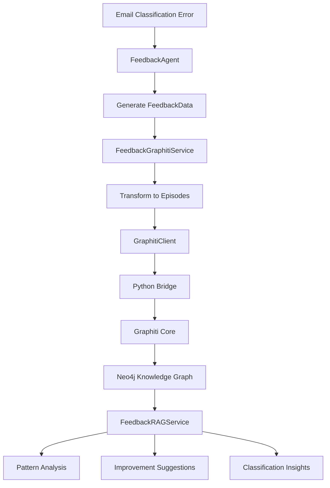

# Feedback Graphiti Integration

本文檔說明如何將 JIRA CS Agent 的反饋數據整合到 Graphiti 知識圖譜中，實現基於 RAG 的反饋分析和系統改進。

## 🎯 目標

- 將 FeedbackAgent 的結構化反饋數據自動導入 Neo4j 知識圖譜
- 使用 Graphiti 建立時序感知的知識圖譜
- 實現基於歷史反饋數據的 RAG 查詢和分析
- 提供分類錯誤模式分析和改進建議

## 🏗️ 架構設計

### 組件結構

```
jiraCSAgent/src/lib/
├── agents/
│   └── feedback-agent.ts          # 更新後的反饋處理代理
├── services/
│   ├── feedback-graphiti-service.ts  # 反饋數據導入服務
│   └── feedback-rag-service.ts      # RAG 查詢服務
├── integrations/
│   ├── graphiti-client.ts          # TypeScript-Python 橋接層
│   └── graphiti-bridge.py          # Python Graphiti 服務
├── config/
│   └── graphiti-config.ts          # 配置管理
├── types/
│   └── graphiti.ts                 # 類型定義
└── examples/
    └── feedback-graphiti-example.ts # 使用示例和測試
```

### 數據流程



## 📊 數據結構

### Episode 類型

FeedbackData 被轉換為 5 個相關的 Graphiti Episodes：

1. **主要反饋分析** (`feedback-main-{id}`)
   - 原始和正確分類對比
   - 錯誤類型和根本原因
   - 信心度差異

2. **錯誤模式分析** (`feedback-error-pattern-{id}`)
   - 錯誤分析詳情
   - 遺漏信號和錯誤假設
   - 模式複雜度

3. **場景映射** (`feedback-scenario-{id}`)
   - 郵件上下文信息
   - 技術複雜度評估
   - 處理代理和步驟

4. **知識更新建議** (`feedback-knowledge-update-{id}`)
   - 新模式和關鍵詞
   - 規則改進建議
   - 優先級分析

5. **系統優化建議** (`feedback-recommendation-{id}`)
   - 模型訓練建議
   - 提示詞優化
   - 品質保證改進

### 元數據標籤

每個 Episode 包含豐富的元數據以支援精確查詢：

```typescript
interface FeedbackGraphitiMetadata {
  feedback_id: string
  error_type: string
  original_category: string
  correct_category: string
  technical_complexity?: string
  processing_agent?: string
  // ... 更多標籤
}
```

## 🚀 安裝和配置

### 1. 環境要求

```bash
# Python 依賴
pip install graphiti-core
pip install neo4j

# Node.js 依賴 (已包含在項目中)
npm install uuid
```

### 2. Neo4j 設置

```bash
# 啟動 Neo4j (Docker)
docker run \
    --name neo4j-graphiti \
    -p 7474:7474 -p 7687:7687 \
    -e NEO4J_AUTH=neo4j/test1234 \
    neo4j:5.22.0
```

### 3. 環境變數配置

在 `.env` 文件中添加：

```env
# Neo4j 連接
NEO4J_URI=bolt://localhost:7687
NEO4J_USER=neo4j
NEO4J_PASSWORD=test1234
NEO4J_DATABASE=neo4j

# Python 配置
PYTHON_PATH=python3
GRAPHITI_SCRIPT_PATH=./src/lib/integrations/graphiti-bridge.py

# 可選：HTTP API 配置
GRAPHITI_API_URL=http://localhost:8000
GRAPHITI_API_KEY=your-api-key

# 日誌配置
LOG_LEVEL=info
ENABLE_GRAPHITI_LOGS=true
```

## 💡 使用方法

### 基本使用

```typescript
import { FeedbackAgent } from '@/lib/agents/feedback-agent'
import { FeedbackRAGService } from '@/lib/services/feedback-rag-service'
import { createGraphitiClient } from '@/lib/integrations/graphiti-client'

// 1. 初始化服務
const graphitiClient = createGraphitiClient()
await graphitiClient.initialize()

const ragService = new FeedbackRAGService(graphitiClient)

// 2. 處理反饋（自動導入 Graphiti）
const feedbackAgent = new FeedbackAgent()
const updatedState = await feedbackAgent.execute(workflowState)

// 3. 查詢反饋洞察
const insights = await ragService.queryFeedbackInsights({
  query: '技術支援分類錯誤',
  category: IntentCategory.TECHNICAL_SUPPORT,
  maxResults: 10
})

console.log(`找到 ${insights.totalRelevantCases} 個相關案例`)
console.log('改進建議:', insights.improvementSuggestions)
```

### RAG 查詢示例

```typescript
// 分析特定錯誤類型
const errorPatterns = await ragService.getErrorTypePatterns('misclassification')

// 獲取分類改進建議
const improvements = await ragService.getClassificationImprovements(
  IntentCategory.GENERAL_INQUIRY,
  IntentCategory.TECHNICAL_SUPPORT,
  'server timeout database error'
)

// 分析低信心度案例
const lowConfidenceAnalysis = await ragService.analyzeLowConfidenceCases(0.7)
```

### 模式分析

```typescript
const result = await ragService.queryFeedbackInsights({
  query: '全面反饋分析',
  maxResults: 50
})

// 錯誤類型分布
result.patternAnalysis.commonErrorTypes.forEach(error => {
  console.log(`${error.type}: ${error.frequency}次 (${error.percentage}%)`)
})

// 常見遺漏信號
result.patternAnalysis.frequentMissedSignals.forEach(signal => {
  console.log(`"${signal.signal}": ${signal.frequency}次`)
})

// 分類混淆矩陣
result.patternAnalysis.categoryConfusionMatrix.forEach(confusion => {
  console.log(`${confusion.from} → ${confusion.to}: ${confusion.frequency}次`)
})
```

## 🔧 Python 橋接配置

### 使用方法選擇

1. **Python 子進程** (推薦用於開發)
   ```env
   PYTHON_PATH=python3
   GRAPHITI_SCRIPT_PATH=./src/lib/integrations/graphiti-bridge.py
   ```

2. **HTTP API** (推薦用於生產)
   ```env
   GRAPHITI_API_URL=http://localhost:8000
   GRAPHITI_API_KEY=your-api-key
   ```

3. **模擬模式** (用於測試)
   ```typescript
   // 不設置上述環境變數，將自動使用模擬模式
   ```

### Python 腳本使用

```bash
# 直接測試 Python 橋接
echo '{"query": "test"}' | python src/lib/integrations/graphiti-bridge.py search

# 添加 episode
echo '{
  "name": "測試Episode",
  "episode_body": "測試數據",
  "source": "json"
}' | python src/lib/integrations/graphiti-bridge.py add_episode
```

## 📈 監控和維護

### 日誌監控

```typescript
import { printConfigSummary, getGraphitiConfig } from '@/lib/config/graphiti-config'

const config = getGraphitiConfig()
printConfigSummary(config) // 打印配置摘要
```

### 性能調優

```typescript
// 配置批次處理
const config = {
  performance: {
    batchSize: 20,           // 批次大小
    maxConcurrentRequests: 10, // 最大並發請求
    cacheEnabled: true,       // 啟用快取
    cacheTTL: 300000         // 快取時間 (5分鐘)
  }
}
```

### 數據清理

```typescript
// 謹慎！這將清除所有圖譜數據
await graphitiClient.clear_data()
await graphitiClient.build_indices_and_constraints()
```

## 🧪 測試和示例

### 運行完整示例

```bash
# 運行示例腳本
npx ts-node src/lib/examples/feedback-graphiti-example.ts
```

### 測試覆蓋

- ✅ FeedbackAgent 與 Graphiti 整合
- ✅ Episode 創建和元數據標籤
- ✅ RAG 查詢和模式分析
- ✅ 改進建議生成
- ✅ 錯誤處理和恢復
- ✅ 配置驗證和環境適應

## 🔍 故障排除

### 常見問題

1. **Neo4j 連接失敗**
   ```bash
   # 檢查 Neo4j 服務狀態
   docker logs neo4j-graphiti
   
   # 測試連接
   curl http://localhost:7474/
   ```

2. **Python 橋接錯誤**
   ```bash
   # 檢查 Python 依賴
   python -c "import graphiti_core; print('OK')"
   
   # 測試腳本
   python src/lib/integrations/graphiti-bridge.py get_status < /dev/null
   ```

3. **Episode 創建失敗**
   - 檢查 Neo4j 連接
   - 驗證 JSON 格式
   - 確認索引是否建立

### 調試模式

```env
LOG_LEVEL=debug
ENABLE_GRAPHITI_LOGS=true
NODE_ENV=development
```

## 🚀 未來擴展

### 計劃功能

1. **即時反饋學習**
   - 自動模型重訓練觸發
   - 動態分類規則更新

2. **高級分析**
   - 時序模式分析
   - 異常檢測和預警

3. **可視化界面**
   - 反饋數據儀表板
   - 知識圖譜可視化

4. **集成優化**
   - GraphQL API 支援
   - 批次處理優化

## 📚 相關資源

- [Graphiti 官方文檔](https://docs.graphiti.ai/)
- [Neo4j 驅動程式文檔](https://neo4j.com/docs/javascript-manual/current/)
- [LangExtract 整合](../KnowledgeBase/agents/extractor.py)
- [原始 FeedbackAgent 實現](./src/lib/agents/feedback-agent.ts)

---

**注意**: 此整合需要 Python 3.8+ 和 Neo4j 5.0+ 支援。在生產環境中使用前，請確保進行充分的測試和性能調優。